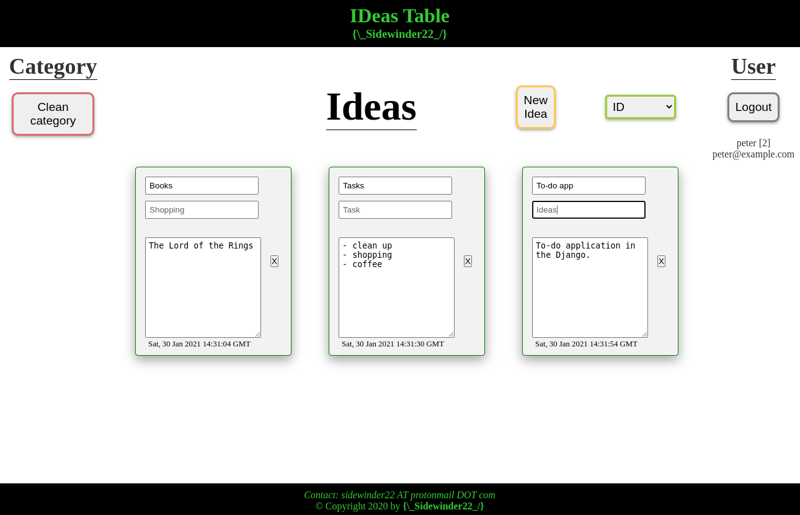

# Ideas Table

IDeas Table - web application for creation and save ideas.

I created this project for educational purposes.  

Technologies used:

* Backend: Python + Flask
* Frontend: JavaScript + React

